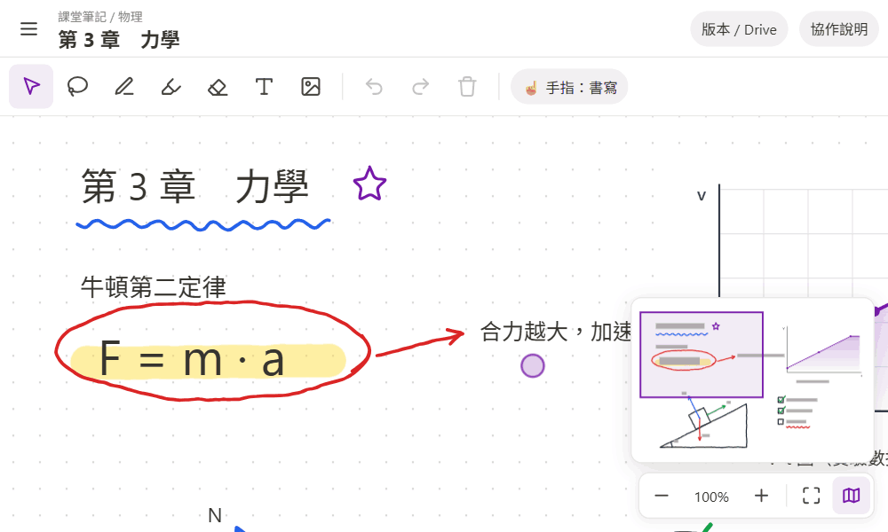
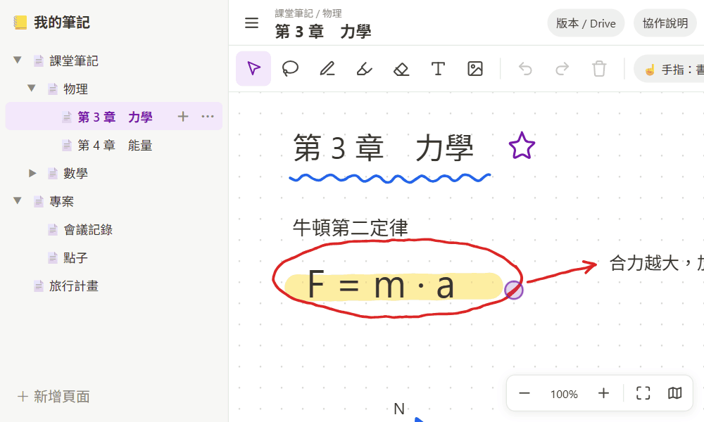
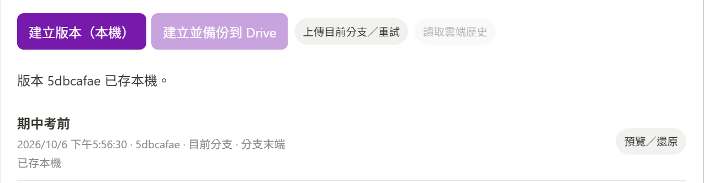
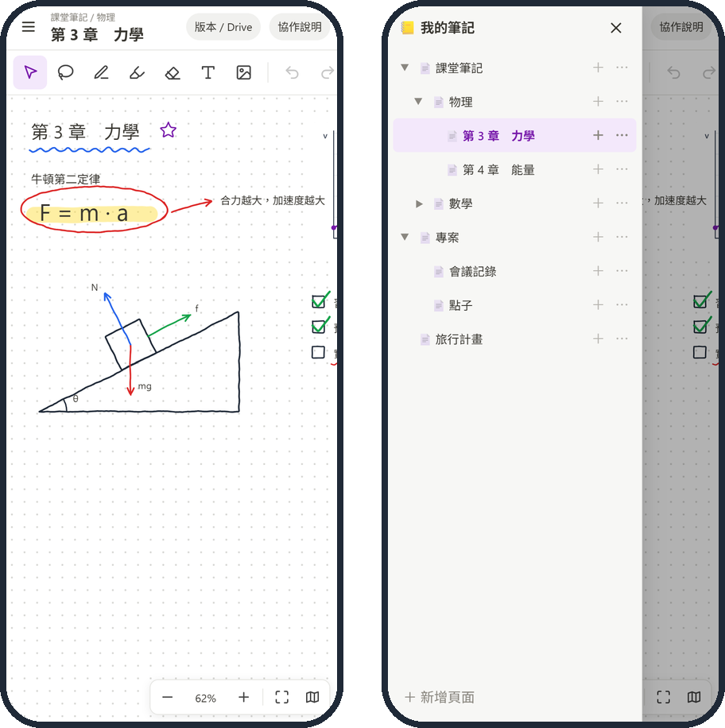

# 📒 筆記 MVP

手寫無限畫布 ＋ 無限層頁面

### 👉 [打開就用](https://jljimmyh.github.io/note-mvp/)　手機・平板・電腦，免安裝

<table>
<tr><th width="50%">✏️ 寫</th><th width="50%">✋ 選取・套索</th></tr>
<tr><td></td><td></td></tr>
<tr><th>🧽 擦</th><th>🔍 縮放</th></tr>
<tr><td></td><td></td></tr>
<tr><th>📁 頁面</th><th>☁️ 備份</th></tr>
<tr><td></td><td></td></tr>
</table>

> ⚠️ 筆記只存在這台裝置的瀏覽器。換裝置、清除瀏覽器資料就看不到 → 用「版本 / Drive」備份。

<kbd>V</kbd> <kbd>L</kbd> <kbd>P</kbd> <kbd>H</kbd> <kbd>E</kbd> <kbd>T</kbd> 切工具　<kbd>Ctrl</kbd>+<kbd>Z</kbd> / <kbd>Y</kbd> 復原／重做　<kbd>Ctrl</kbd>+<kbd>V</kbd> 貼上　<kbd>Ctrl</kbd>+滾輪 縮放　<kbd>M</kbd> 小地圖

---

開發：`python server.py` → http://localhost:8000 ・ [協作設定](collaboration/README.md) ・ [Google Drive 設定](docs/GOOGLE_DRIVE_SETUP.md)
