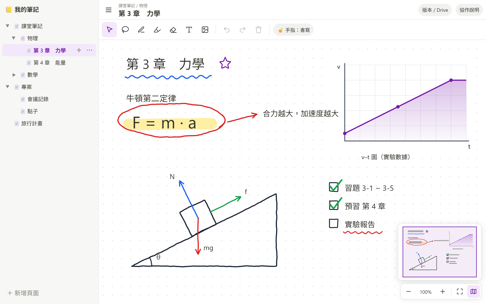
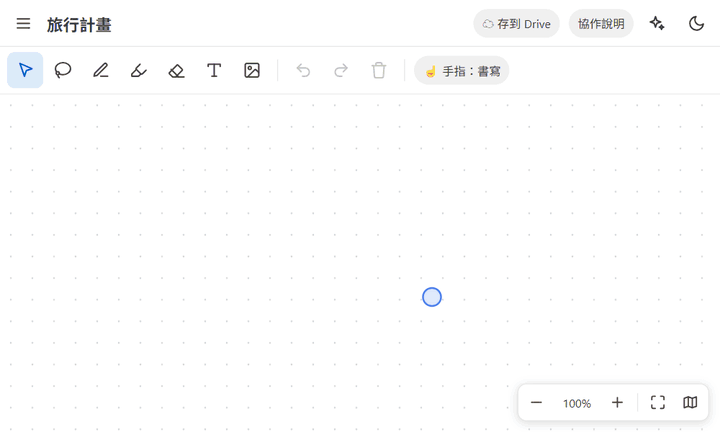
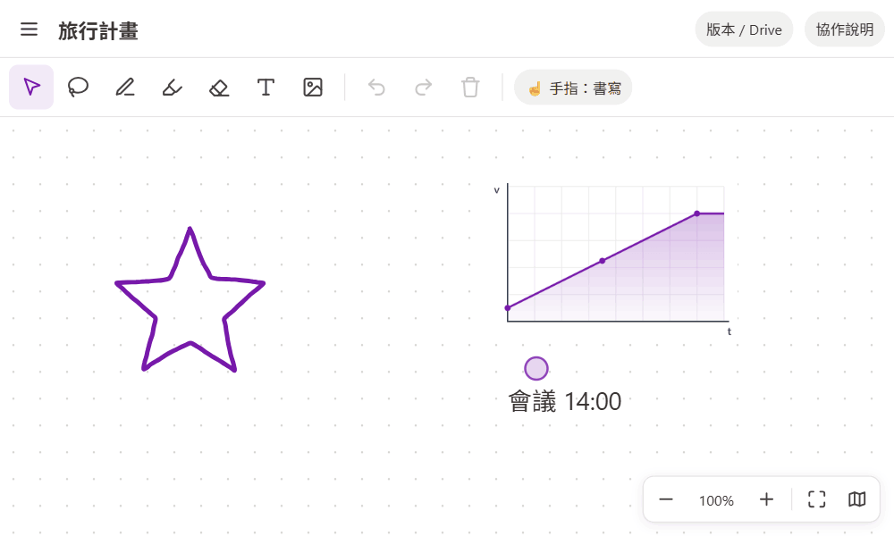
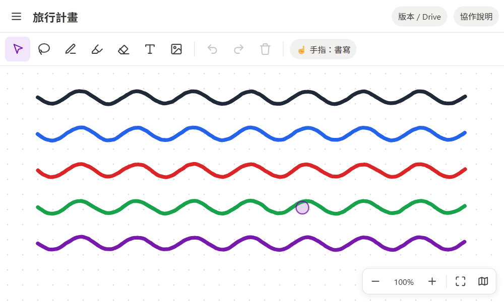

# 📒 Snake Note

手寫無限畫布 ＋ 無限層頁面　👉 **[打開就用](https://jljimmyh.github.io/Snake/)**

<table><tr>
<td width="33%"></td>
<td width="33%"></td>
<td width="33%"></td>
</tr></table>

> ⚠️ 筆記存在這台裝置的瀏覽器 → 點左上角筆記本名稱「存到 Drive」或「匯出 zip」

📋 右鍵「複製」選取的物件（空白處＝複製全部）→ Ctrl+V 貼到別頁，或直接貼給 ChatGPT／Claude；AI 回的 JSON 也能 Ctrl+V 貼回畫布

<kbd>V</kbd> <kbd>L</kbd> <kbd>P</kbd> <kbd>H</kbd> <kbd>E</kbd> <kbd>T</kbd> 工具　<kbd>Ctrl</kbd>+<kbd>Z</kbd>/<kbd>Y</kbd> 復原　<kbd>Ctrl</kbd>+<kbd>S</kbd> 存到 Drive　<kbd>M</kbd> 小地圖

開發：`python server.py` ・ [協作設定](collaboration/README.md) ・ [Drive 設定](docs/GOOGLE_DRIVE_SETUP.md)
